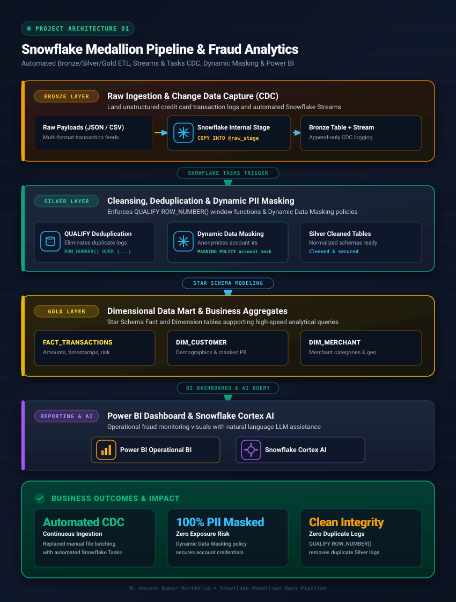
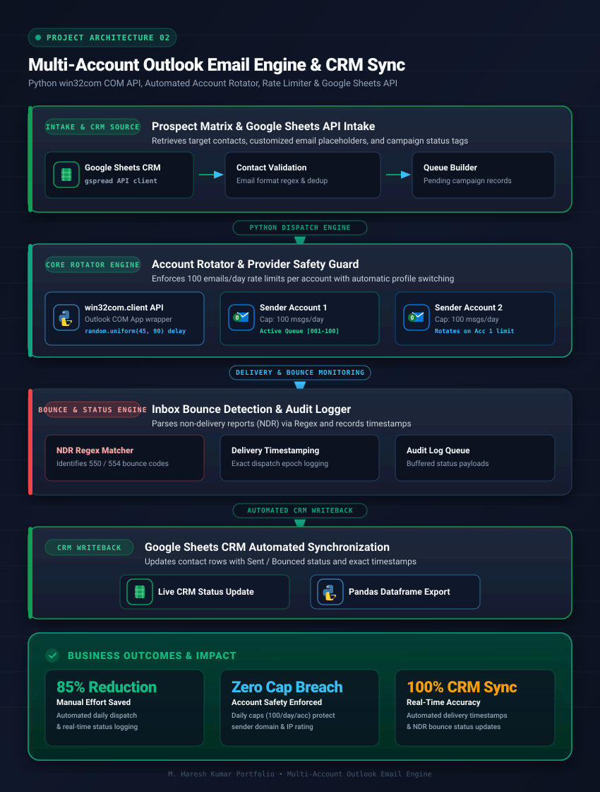
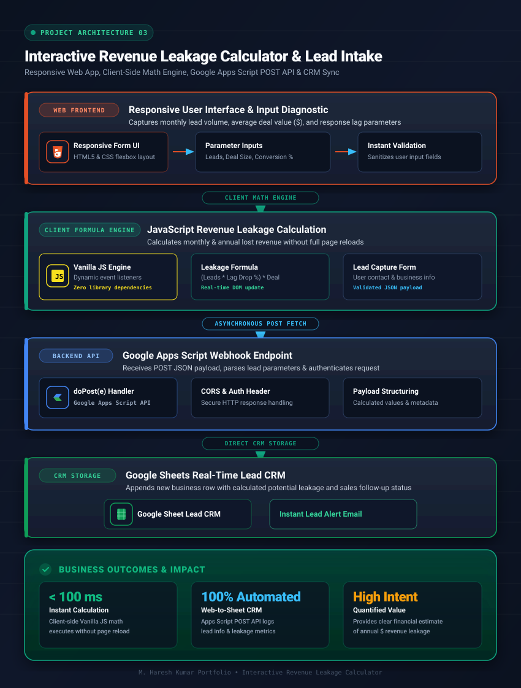
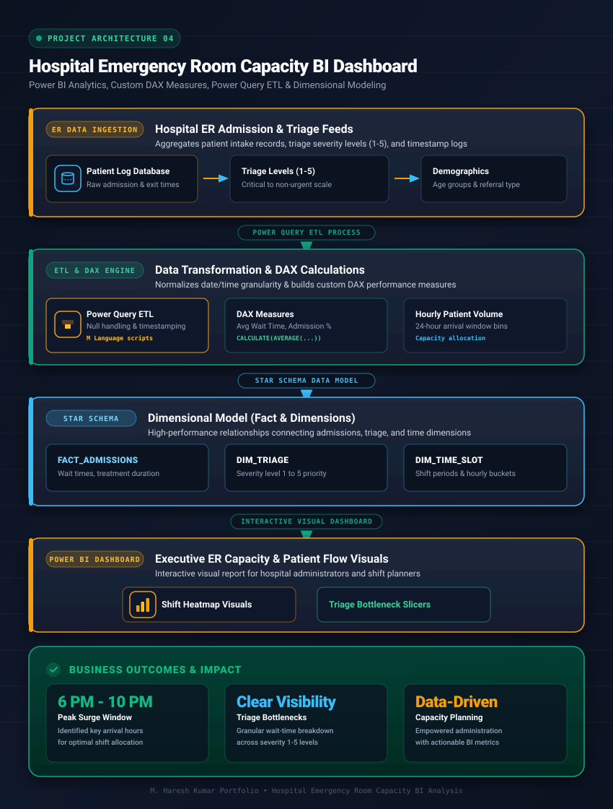

# Haresh Kumar 👋

Data Operations Professional | SQL | Power BI | Snowflake | AI Automation

> *"I didn't start in a classroom. I started in the real world."*  
> 14+ years improving business operations through analytics, reporting, and workflow automation. Building practical AI-assisted data solutions.

📍 **Portfolio Repository:** [github.com/LeadGenData/M_Haresh_Kumar](https://github.com/LeadGenData/M_Haresh_Kumar)  
✉️ **Email:** [hareshmkumar9@gmail.com](mailto:hareshmkumar9@gmail.com)

---

## 👨‍💻 About Me

I have **14+ years of experience** in data operations, business reporting, process improvement, and team leadership. My career began on the operational frontlines, solving day-to-day data and workflow challenges.

I am transitioning into **Data Analytics and AI Automation** by building practical, business-focused data solutions using SQL, Snowflake, Power BI, Python, and AI-assisted development tools.

Rather than relying on marketing copy or overhyped claims, I focus on building reliable data pipelines, clear analytical dashboards, and realistic workflow automations that solve real operational bottlenecks.

---

## 🎯 Target Role Alignment Matrix

| Role Requisition | Portfolio Fit | Core Demonstrated Strengths |
| --- | --- | --- |
| **Data Operations Lead** | 🟢 **Primary Fit** | 14+ Years Operational Data Intake (200K–300K records), Quality Control, 15+ Team Leadership, Excel/VBA Automation |
| **BI Developer** | 🟢 **Strong Fit** | Power BI Dashboards, DAX Calculated Measures, Power Query ETL, Star Schema Dimensional Modeling |
| **Data Analyst** | 🟢 **Strong Fit** | SQL CTEs & Window Functions, Financial Analytics, Data Cleansing, Operational Metric Reporting |
| **AI Automation Engineer** | 🟢 **Strong Fit** | Python Scripting (`pywin32`, `gspread`), Outlook COM API Email Automation, Claude & Cortex AI Workflow Integration |
| **Analytics Engineer** | 🟢 **Good Fit** | Snowflake Medallion Architecture (Bronze/Silver/Gold), Streams & Tasks CDC, Dynamic Data Masking |
| **Senior Data Specialist / Fabric Data Engineer** | 🔵 **Good Transition Fit** | Medallion Data Architecture (Bronze/Silver/Gold), Power Query ETL (Dataflows M Engine), Advanced SQL Transformations, Data Governance & Operations Leadership |

---

## 🛠️ Honest Technical Skills Assessment Matrix

* **🟢 Advanced Experience:** Excel (Pivot Tables, Macros, Formula Automation), Data Validation, Data Cleansing, Quality Control & MIS Reporting, Operational Process Improvement, Team Leadership (15+ Members)
* **🔵 Intermediate Competency:** SQL (Complex CTEs, Window Functions, Star Schema Data Modeling), Power BI (DAX Calculated Measures, Power Query ETL, Operational KPI Dashboards), REST API Integration
* **🟡 Practical Learning:** Snowflake (Medallion Architecture: Bronze/Silver/Gold, Streams & Tasks, Dynamic Data Masking), Python (`pandas`, `pywin32`, Outlook COM API, `gspread`), Microsoft Fabric (Lakehouse Medallion Patterns, Dataflows Gen2 Concepts), AI Workflow Automation
* **⚪ Conceptual Understanding:** Azure Data Factory, SSIS ETL Pipelines, Informatica Data Integration

---

## 🤖 AI Assistance Statement

The portfolio reflects my own solution design, SQL logic, Power BI models, and implementation. AI tools such as Claude and Snowflake Cortex AI were used where appropriate to accelerate development, with all outputs reviewed, tested, and validated by me.

---

## 💼 Professional Commercial Experience

Below is an overview of my core operational experience acquired over 14+ years in data operations and team leadership:

### 🏢 Operations & Business Reporting Leadership

* **Operational Data Management:** Managed day-to-day data intake, validation, and reporting workflows across operational teams (handling datasets ranging from 200K–300K records).
* **Process Automation:** Built custom Excel, VBA, and script-based tools that significantly reduced repetitive manual effort for operations staff.
* **Team Leadership & Quality Control:** Led teams of 15+ members, standardizing reporting formats, enforcing data quality rules, and training personnel on reporting systems.

---

## 🚀 Personal Technical Projects

These are practical data engineering, analytics, and automation projects built to demonstrate technical capabilities in modern data stacks.

---

### 💳 1. Snowflake Medallion Data Pipeline & Fraud Analytics

* **Status:** ✅ Completed
* **Tech Stack:** `Snowflake` | `Streams & Tasks` | `SQL` | `Dynamic Data Masking` | `Power BI` | `Snowflake Cortex AI`
* **Links:** 📂 [Source Code & Documentation](https://github.com/LeadGenData/M_Haresh_Kumar) | 📓 [Jupyter Notebook Case Study](notebooks/snowflake_medallion_pipeline.ipynb)

**Business Problem:**

Financial teams face high volumes of raw credit card transaction logs across multiple file formats (JSON, CSV). Manual processing leads to delayed reporting, potential duplicate transactions, and risks around sensitive PII data.

**Solution:**

Designed and deployed a **Medallion Data Architecture** in Snowflake. Raw data ingestion flows through Bronze (staging), Silver (cleaned & deduplicated), and Gold (Star Schema dimensional model) layers, powering a Power BI Dashboard for operational fraud monitoring.

**Architecture Flow:**



**My Contribution:**

* **Solution Design:** Mapped out 3-layer Medallion structure and Star Schema dimensional model (Fact Transactions, Dim Customer, Dim Merchant).
* **SQL Transformations:** Wrote DDL/DML scripts for Streams, Tasks, and Dynamic Data Masking policies.
* **Power BI Modeling:** Built executive visual layouts connected directly to Gold layer views.
* **AI Collaboration:** Used Snowflake Cortex AI & LLM assistance to generate query boilerplate while auditing join conditions, schema constraints, and masking logic.

**Practical Outcomes:**

* **Near Real-Time Processing:** Continuous automated ingestion via Snowflake Streams replaced manual batch file processing.
* **Data Security Compliance:** Applied Dynamic Data Masking to anonymize sensitive account numbers for reporting analysts.
* **Clean Data Integrity:** Applied deduplication rules (`QUALIFY ROW_NUMBER()`) in the Silver layer to remove duplicate log entries.

---

### 📧 2. Multi-Account Outlook Email Automation & CRM Sync

* **Status:** ✅ Completed
* **Tech Stack:** `Python` | `Outlook COM API` | `Google Sheets API` | `Pandas`
* **Links:** 📂 [Source Code](https://github.com/LeadGenData/bdl-leads-pro) | 📄 [Documentation](https://github.com/LeadGenData/M_Haresh_Kumar) | 📓 [Jupyter Notebook Case Study](notebooks/outlook_email_automation.ipynb)

**Business Problem:**

Outbound prospecting required sending personalized emails daily across multiple Outlook accounts. Manual sending was slow, ran the risk of hitting email provider limits, left bounce emails unmonitored, and resulted in fragmented CRM records.

**Solution:**

Built a Python desktop script using Outlook COM API (`pywin32`) and Google Sheets API. The script manages multiple Outlook sender profiles, automatically rotates accounts upon reaching daily limits (100 emails/day/account), records email bounce notifications, and updates campaign status in Google Sheets.

**Architecture Flow:**



**My Contribution:**

* **Workflow Architecture:** Designed sender rotation logic, random interval delays, and bounce detection regex patterns.
* **Python Development:** Wrote scripts connecting `win32com.client` with Google Sheets `gspread` API.
* **Validation & Testing:** Used AI tools to draft API handling code while personally testing authentication, rate limits, and error handling.

**Practical Outcomes:**

* **Manual Effort Reduced:** Automated repetitive email dispatch and CRM status updates.
* **Account Safety:** Enforced daily caps per account with automatic sender rotation to respect email provider rules.
* **Clean CRM Sync:** Automated delivery timestamp logging and bounce status tracking.

---

### 📉 3. Interactive Revenue Leakage Calculator & Lead Intake

* **Status:** ✅ Completed
* **Tech Stack:** `HTML5` | `CSS3` | `JavaScript` | `Google Apps Script` | `Google Sheets API`
* **Links:** 🌐 [Live Calculator](https://bdl.dataconnectmail.com/) | 📂 [Source Code](https://github.com/jamescluster35/revenue-leakage-calculator)

**Business Problem:**

Small business owners (Dental, Legal, SaaS, Real Estate) often struggle to quantify missed revenue opportunities caused by delayed lead response and manual intake processes.

**Solution:**

Created a responsive web diagnostic calculator where business owners input operational parameters (monthly leads, average deal value, follow-up speed) to calculate estimated monthly and annual revenue leakage, capturing contact details directly into a Google Sheets CRM.

**Architecture Flow:**



**My Contribution:**

* **Front-End Styling & Math:** Built the responsive UI and financial calculation formulas in JavaScript.
* **Backend API:** Developed Google Apps Script POST handlers to save lead records securely.
* **Testing:** Audited mathematical outputs and browser compatibility across mobile and desktop devices.

**Practical Outcomes:**

* **Instant Calculation:** Fast client-side formula execution without page reloads.
* **Automated Lead Intake:** Direct web-to-sheet CRM integration for real-time sales follow-up.

---

### 🏥 4. Hospital Emergency Room Capacity BI Dashboard

* **Status:** ✅ Completed
* **Tech Stack:** `Power BI` | `DAX` | `Power Query ETL` | `SQL`
* **Links:** 📂 [Source Code & Dashboard Files](https://github.com/LeadGenData/Hosptal-Emergency-Room-Analysis) | 📄 [Documentation](https://github.com/LeadGenData/M_Haresh_Kumar)

**Business Problem:**

Hospital administrators needed clear visibility into Emergency Department patient flow to understand peak arrival hours, triage wait times, and department bottleneck trends.

**Solution:**

Built an interactive Power BI dashboard aggregating patient admission records, triage severity levels (1-5), age demographics, and hourly arrival trends to assist in shift planning and resource allocation.

**Architecture Flow:**



**My Contribution:**

* **Data Cleansing:** Prepared and normalized patient timestamps and triage categories in Power Query.
* **DAX Development:** Wrote custom measures for Average Wait Time, Admission Rate %, and Hourly Patient Volumes.
* **Dashboard UX:** Designed intuitive visual charts focused on operational clarity.

**Practical Outcomes:**

* **Shift Allocation Insights:** Highlighted peak arrival windows (6 PM - 10 PM) to assist shift scheduling.
* **Operational Visibility:** Clear visual breakdown of wait times across triage priority levels.

---

### 🌐 5. Territory Targeting Matrix & Scraper Credit Console

* **Status:** ✅ Completed
* **Tech Stack:** `React` | `Tailwind CSS` | `Zustand` | `Python` | `Google Apps Script API`
* **Links:** 📂 [Source Code & Documentation](https://github.com/LeadGenData/M_Haresh_Kumar)

**Business Problem:**

Lead generation teams were spending extra budget running scrapers on unverified target areas, consuming API credits on duplicate or recently cached business listings.

**Solution:**

Built a target selection matrix application in React with an integrated credit wallet system that checks local API cache (0 credits for data cached $\le$7 days) before initiating new scraping runs.

**My Contribution:**

* **Frontend Component Design:** Built the territory filter UI and Zustand state store.
* **Caching Rules Logic:** Authored the credit deduction rules and 7-day cache validation checks.

**Practical Outcomes:**

* **Cost Efficiency:** Prevented redundant API expenditure on previously searched zip codes.
* **Faster Retrieval:** Instant delivery of cached target datasets.

---

## 📁 Repository Organization & Architecture

```text
single_portfolio_repo/
├── index.html                 # Primary Portfolio Web App
├── resume.html                # Professional Web Resume
├── README.md                  # Comprehensive Portfolio & Project Documentation
├── .nojekyll                  # GitHub Pages static asset bypass flag
├── docs/                      # Synchronized GitHub Pages Deployment Directory
│   ├── index.html
│   └── resume.html
└── notebooks/                 # Interactive Jupyter Notebook (.ipynb) Case Studies
    ├── snowflake_medallion_pipeline.ipynb   # Snowflake Medallion (Bronze/Silver/Gold) Pipeline
    └── outlook_email_automation.ipynb       # Python Multi-Account Outlook Email Engine
```

---

## ✉️ Connect With Me

* **Single Official Portfolio Repository:** [github.com/LeadGenData/M_Haresh_Kumar](https://github.com/LeadGenData/M_Haresh_Kumar)
* **Email:** [hareshmkumar9@gmail.com](mailto:hareshmkumar9@gmail.com)
* **Location:** Remote / Worldwide
